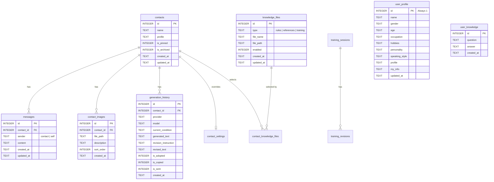

# Matching Reply Assistant - アプリケーション仕様書・詳細設計書

本ドキュメントは、**Matching Reply Assistant** の全体像、システムアーキテクチャ、ディレクトリ・ファイル構成、データベース設計、REST API仕様、AIプロンプト設計、画面仕様、運用手順を網羅した詳細仕様書です。
ChatGPTをはじめとするAIアシスタントや開発者が、本システムの仕様・実装ロジックを正確に把握・解析できるように構成されています。

---

## 1. アプリケーション概要 (Project Overview)

### 1.1 目的とコンセプト
- **概要**: マッチングアプリのメッセージやり取りをシミュレート・再現し、AIを活用して自然で好印象な返信文章の作成・修正・保存・練習・評価を行うローカル完結型のWebアプリケーションです。
- **外部連携の完全排除**: 実際のマッチングアプリ（Pairs, with, Tinder, タップル等）とはAPI等で一切連携しません。相手のメッセージを本アプリにコピー＆ペーストして記録し、生成された返信文章をコピーして実際のマッチングアプリへ貼り付けます。
- **ローカルファースト・可搬性**: すべてのデータ（SQLite、画像、ルールテキスト、バックアップ）はプロジェクトルート相対パスで保存され、フォルダごと別PCにコピーするだけで移行・動作可能です。API Keyなどの機密情報はフロントエンドへ渡さず、バックエンドのみで安全に管理されます。

### 1.2 最重要ユーザーフロー
```text
[相手メッセージをコピー] 
   ↓
[本アプリで「相手として送信」] 
   ↓
[返信条件・トーンを指定し「返信を生成」] 
   ↓
[生成結果確認（必要なら「修正して再生成」または「AIからの逆質問に回答」）] 
   ↓
[「コピー」して実際のマッチングアプリへ貼り付け] 
   ↓
[「送信（履歴に追加）」でアプリ内チャットに自分の発言として記録]
```

---

## 2. システムアーキテクチャ & 技術スタック (Architecture & Tech Stack)

### 2.1 システム構成図
```text
┌────────────────────────────────────────────────────────┐
│                   Web Browser (UI)                     │
│  React 18 + TypeScript + Vite + Tailwind CSS           │
│  (開発時: http://localhost:5173 / 本番時: :8000静的配信) │
└───────────────────────────┬────────────────────────────┘
                            │ HTTP / JSON REST API
                            ▼
┌────────────────────────────────────────────────────────┐
│               Backend (FastAPI / Python 3.12)          │
│  ├── main.py (ルーティング・静的配信・CORS)            │
│  ├── routers/ (各機能別 REST API エンドポイント)        │
│  ├── ai/ (AI Provider抽象化・プロンプト生成・フォールバック) │
│  └── database.py (SQLite / WAL / マイグレーション)     │
└──────────────┬──────────────────────────┬──────────────┘
               │                          │
               ▼                          ▼
┌──────────────────────────────┐ ┌────────────────────────┐
│      ローカルストレージ      │ │      外部 AI API       │
│  ├── SQLite (data/app.db)    │ │  ├── Cerebras API      │
│  ├── 画像 (data/contacts/)   │ │  ├── NVIDIA NIM API    │
│  ├── ナレッジ (knowledge/)   │ │  └── Google Gemini API │
│  └── バックアップ (backups/) │ └────────────────────────┘
└──────────────────────────────┘
```

### 2.2 技術スタック詳細
| レイヤー | 技術 / ライブラリ | 用途・詳細 |
|---|---|---|
| **Frontend** | React 18, TypeScript, Vite 5, Tailwind CSS 3 | SPA構築、高速HMR、レスポンシブUI（半画面/狭幅対応） |
| **Backend** | Python 3.12 (3.10+対応), FastAPI, Uvicorn, Pydantic v2 | 非同期Web APIサーバー、リクエストバリデーション |
| **Database** | SQLite 3 (`data/app.db`) | WALモード、外部キー制約有効、起動時自動マイグレーション |
| **AI 推論基盤** | Cerebras / NVIDIA NIM / Google Gemini | 高速LLM推論（デフォルト: `gpt-oss-120b`）、自動リトライ＆フォールバック |
| **環境構築・起動** | Windows Batch (`.bat`), Shell Script (`.sh`) | バックグラウンド起動、空きポート自動検出(8000〜8020)、Chrome Appモード起動 |

---

## 3. ディレクトリ構成 & ファイル一覧 (Directory Structure)

```text
c:\Users\poiuy\Desktop\AIチャットアプリ/
├── 起動.bat                # Windows用ワンクリック起動バッチ（ポート自動判定・Chrome起動）
├── 終了.bat                # Windows用プロセス終了バッチ
├── 導入.bat                # Windows用ワンクリックセットアップバッチ
├── .env / .env.example     # 環境変数定義（APIキー、デフォルト設定）
├── README.md               # 本仕様書
├── backend/                # Python FastAPI バックエンド
│   ├── requirements.txt    # 本番依存パッケージ (fastapi, uvicorn, pydantic, requests, python-dotenv)
│   ├── requirements-dev.txt# 開発用パッケージ (pytest, ruff 等)
│   ├── app/
│   │   ├── __init__.py
│   │   ├── main.py         # FastAPIエントリポイント、CORS、ルーター登録、静的配信
│   │   ├── config.py       # パス解決、ロギング、ディレクトリ初期化、定数定義
│   │   ├── database.py     # SQLite DDL、マイグレーション、DBアクセス関数群
│   │   ├── schemas.py      # Pydantic v2 入出力スキーマ定義
│   │   ├── ai/             # AI連携・プロンプトエンジン
│   │   │   ├── __init__.py
│   │   │   ├── base.py     # AIProvider 抽象クラス、AIError 定義
│   │   │   ├── config.py   # AI設定解決（DB > .env > デフォルト値）、相手別設定マージ
│   │   │   ├── factory.py  # Providerファクトリ、フォールバックプロバイダ取得
│   │   │   ├── cerebras.py # Cerebras API 実装 (gpt-oss-120b 等)
│   │   │   ├── nvidia.py   # NVIDIA NIM API 実装 (Llama-3.3, Mistral 等)
│   │   │   ├── gemini.py   # Google Gemini API 実装 (gemini-2.5-flash 等)
│   │   │   └── prompt.py   # 11層プロンプト組み立て、文字数バジェット制御、修正プロンプト
│   │   └── routers/        # REST API エンドポイント群
│   │       ├── __init__.py
│   │       ├── contacts.py   # 相手CRUD、ピン留め、アーカイブ、相手別AI設定
│   │       ├── messages.py   # メッセージCRUD、テキストエクスポート
│   │       ├── generation.py # AI返信生成、送信プレビュー、履歴保存、逆質問処理
│   │       ├── settings.py   # AI全体設定、プロバイダ別APIキー保存
│   │       ├── profile.py    # ユーザー自身プロフィール(SELF)、逆質問ナレッジ(USER KNOWLEDGE)
│   │       ├── knowledge.py  # ルール・参考資料・学習用テキスト管理
│   │       ├── history.py    # AI生成履歴の確認・復元・ステータス更新
│   │       ├── images.py     # 相手プロフィール画像アップロード(最大20枚)・配信・説明文
│   │       ├── training.py   # AI練習セッション、返信5項目評価、良例データ管理
│   │       ├── like_bot.py   # いいね用初回メッセージ3案生成
│   │       └── backup.py     # 全データZIPバックアップ作成・一覧・復元
│   └── tests/
│       └── test_api.py     # バックエンド単体/統合テスト
├── frontend/               # React + TypeScript フロントエンド
│   ├── package.json
│   ├── vite.config.ts      # Viteビルド設定（/api プロキシ設定）
│   ├── tsconfig.json
│   ├── index.html
│   └── src/
│       ├── main.tsx        # Reactマウント
│       ├── App.tsx         # メイン画面（タブ切替、検索、通知、半画面対応）
│       ├── api.ts          # バックエンドAPI通信クライアント
│       ├── types.ts        # TypeScript型定義
│       ├── replyDirections.ts # 返信条件プリセット定義
│       ├── format.ts       # 日時・テキスト整形ユーティリティ
│       └── components/     # UIコンポーネント群
│           ├── ContactList.tsx        # 相手一覧（検索・ピン・アーカイブ・最新メッセージ）
│           ├── ContactModal.tsx       # 相手情報編集・画像管理・相手別AI設定
│           ├── ChatArea.tsx           # チャット履歴タイムライン・上部バー・返信生成統合
│           ├── MessageBubble.tsx      # メッセージ吹き出し（編集・削除・時間）
│           ├── MessageInput.tsx       # メッセージ入力欄（相手/自分送信）
│           ├── GenerationPanel.tsx    # 返信生成パネル（条件・トーン・案数・再生成・逆質問回答）
│           ├── PromptPreviewModal.tsx # AI送信プロンプト事前確認モーダル
│           ├── SettingsModal.tsx      # システム設定（APIキー・パラメータ・知識ファイル・バックアップ）
│           ├── MyInfoModal.tsx        # 自分情報簡易設定（アレルギー・NG話題等）
│           ├── LearningView.tsx       # 学習モードタブコンテナ
│           ├── PracticePanel.tsx      # AI会話練習シミュレータ（ペルソナ相手とのラリー）
│           ├── EvaluatePanel.tsx      # 返信の5項目評価＆添削パネル
│           ├── KnowledgePanel.tsx     # 良い返信例（training_examples）管理
│           ├── ProfilePanel.tsx       # 自分のプロフィール＆蓄積ナレッジ管理
│           ├── MaterialsPanel.tsx     # ナレッジテキストの閲覧・管理
│           ├── LikeBot.tsx            # プロフィールからのいいね初回メッセージ生成
│           ├── BackupPanel.tsx        # バックアップ作成・復元UI
│           ├── Modal.tsx              # 共通モーダルラッパー
│           └── ConfirmDialog.tsx      # 共通確認ダイアログ
├── knowledge/              # AI生成時に参照するナレッジテキスト（Git管理）
│   ├── rules/              # 【RULES】絶対遵守ルール
│   ├── references/         # 【REFERENCES】マッチング戦略・ノウハウ資料
│   └── training/           # 【LEARNING MATERIALS】厳選された会話良例テキスト
├── data/                   # アプリ稼働データ（Git管理外）
│   ├── app.db              # SQLite データベース実体
│   ├── contacts/{id}/      # 相手ごとのアップロード画像ファイル
│   └── backups/            # ZIPバックアップファイル
├── scripts/                # 補助スクリプト (setup, start, dev)
└── docs/                   # 開発ドキュメント (ARCHITECTURE.md, AI.md, DATABASE.md 等)
```

---

## 4. データベース設計 (Database Schema)

SQLite（`data/app.db`）を使用。WALモード（Write-Ahead Logging）で動作し、外部キー制約を強制します。



### 4.1 テーブル定義一覧

#### 1. `contacts` (相手情報)
| カラム名 | 型 | 制約 | 説明 |
|---|---|---|---|
| `id` | INTEGER | PRIMARY KEY AUTOINCREMENT | 相手ID |
| `name` | TEXT | NOT NULL | 相手の名前（表示名） |
| `profile` | TEXT | NOT NULL DEFAULT '' | 相手のプロフィール自由記述 |
| `is_pinned` | INTEGER | NOT NULL DEFAULT 0 | ピン留め状態 (0: 通常, 1: ピン留め) |
| `is_archived` | INTEGER | NOT NULL DEFAULT 0 | アーカイブ状態 (0: アクティブ, 1: アーカイブ) |
| `created_at` | TEXT | NOT NULL | 作成日時 (ISO8601 UTC) |
| `updated_at` | TEXT | NOT NULL | 更新日時 (ISO8601 UTC) |

#### 2. `messages` (チャットメッセージ)
| カラム名 | 型 | 制約 | 説明 |
|---|---|---|---|
| `id` | INTEGER | PRIMARY KEY AUTOINCREMENT | メッセージID |
| `contact_id` | INTEGER | NOT NULL, FK→`contacts(id)` ON DELETE CASCADE | 相手ID |
| `sender` | TEXT | NOT NULL CHECK (sender IN ('contact', 'self')) | 送信者 (`contact`: 相手, `self`: 自分) |
| `content` | TEXT | NOT NULL | メッセージ本文 |
| `created_at` | TEXT | NOT NULL | 送信/記録日時 (ISO8601 UTC) |
| `updated_at` | TEXT | NOT NULL | 編集日時 (ISO8601 UTC) |
*インデックス*: `CREATE INDEX idx_messages_contact ON messages(contact_id, created_at);`

#### 3. `contact_images` (相手プロフィール画像)
| カラム名 | 型 | 制約 | 説明 |
|---|---|---|---|
| `id` | INTEGER | PRIMARY KEY AUTOINCREMENT | 画像ID |
| `contact_id` | INTEGER | NOT NULL, FK→`contacts(id)` ON DELETE CASCADE | 相手ID |
| `file_path` | TEXT | NOT NULL | プロジェクトルート基準の相対/絶対パス |
| `description` | TEXT | NOT NULL DEFAULT '' | 画像の説明文（AIプロンプトに渡される） |
| `sort_order` | INTEGER | NOT NULL DEFAULT 0 | 表示順・サムネイル優先順 (0が先頭) |
| `created_at` | TEXT | NOT NULL | アップロード日時 (ISO8601 UTC) |

#### 4. `generation_history` (AI返信生成履歴)
| カラム名 | 型 | 制約 | 説明 |
|---|---|---|---|
| `id` | INTEGER | PRIMARY KEY AUTOINCREMENT | 履歴ID |
| `contact_id` | INTEGER | FK→`contacts(id)` ON DELETE SET NULL | 相手ID |
| `provider` | TEXT | NOT NULL | 生成時プロバイダ名 (`cerebras`, `nvidia`, `gemini`) |
| `model` | TEXT | NOT NULL | 生成時モデル名 (`gpt-oss-120b` 等) |
| `current_condition` | TEXT | NOT NULL DEFAULT '' | 今回の返信条件・指示 |
| `generated_text` | TEXT | NOT NULL | 生成された返信文章 |
| `revision_instruction`| TEXT | NOT NULL DEFAULT '' | 修正指示（修正再生成時のみ） |
| `revised_text` | TEXT | NOT NULL DEFAULT '' | 修正後文章（修正再生成時のみ） |
| `is_adopted` | INTEGER | NOT NULL DEFAULT 0 | 採用フラグ (0/1) |
| `is_copied` | INTEGER | NOT NULL DEFAULT 0 | クリップボードコピーフラグ (0/1) |
| `is_sent` | INTEGER | NOT NULL DEFAULT 0 | アプリ内チャット送信フラグ (0/1) |
| `created_at` | TEXT | NOT NULL | 生成日時 (ISO8601 UTC) |

#### 5. `user_profile` (ユーザー自身のプロフィール【SELF】)
| カラム名 | 型 | 制約 | 説明 |
|---|---|---|---|
| `id` | INTEGER | PRIMARY KEY CHECK (id = 1) | 単一レコード固定 (id=1) |
| `name` | TEXT | NOT NULL DEFAULT '' | ユーザーのニックネーム |
| `gender` | TEXT | NOT NULL DEFAULT '' | 性別 |
| `age` | TEXT | NOT NULL DEFAULT '' | 年齢 |
| `occupation` | TEXT | NOT NULL DEFAULT '' | 職業 |
| `hobbies` | TEXT | NOT NULL DEFAULT '' | 趣味 |
| `personality` | TEXT | NOT NULL DEFAULT '' | 性格・タイプ |
| `speaking_style` | TEXT | NOT NULL DEFAULT '' | 話し方・文体の特徴 |
| `profile` | TEXT | NOT NULL DEFAULT '' | プロフィール自由記述 |
| `my_info` | TEXT | NOT NULL DEFAULT '' | ユーザー前提条件（お酒NG、アレルギー、NG話題等） |
| `updated_at` | TEXT | NOT NULL | 更新日時 (ISO8601 UTC) |

#### 6. `user_knowledge` (ユーザー蓄積知識【USER KNOWLEDGE】)
| カラム名 | 型 | 制約 | 説明 |
|---|---|---|---|
| `id` | INTEGER | PRIMARY KEY AUTOINCREMENT | 知識ID |
| `question` | TEXT | NOT NULL | AIからの逆質問内容（例: 「Kingdom見たことありますか？」） |
| `answer` | TEXT | NOT NULL | ユーザーの回答（例: 「見たことない」「アニメ版だけ見た」） |
| `created_at` | TEXT | NOT NULL | 登録日時 (ISO8601 UTC) |

#### 7. `knowledge_files` (ナレッジファイル管理)
| カラム名 | 型 | 制約 | 説明 |
|---|---|---|---|
| `id` | INTEGER | PRIMARY KEY AUTOINCREMENT | ファイル管理ID |
| `type` | TEXT | NOT NULL | 種別 (`rules`: ルール, `references`: 参考, `training`: 学習) |
| `file_name` | TEXT | NOT NULL | ファイル名 (例: `基本ルール.txt`) |
| `file_path` | TEXT | NOT NULL | ファイルの実体パス |
| `enabled` | INTEGER | NOT NULL DEFAULT 1 | 有効/無効フラグ (0: 無効, 1: 有効) |
| `created_at` | TEXT | NOT NULL | 登録日時 (ISO8601 UTC) |
| `updated_at` | TEXT | NOT NULL | 更新日時 (ISO8601 UTC) |

#### 8. `contact_settings` (相手別AI設定上書き)
| カラム名 | 型 | 制約 | 説明 |
|---|---|---|---|
| `contact_id` | INTEGER | PRIMARY KEY, FK→`contacts(id)` ON DELETE CASCADE | 相手ID |
| `provider` | TEXT | NULLABLE | 個別プロバイダ（NULLなら全体設定） |
| `model` | TEXT | NULLABLE | 個別モデル（NULLなら全体設定） |
| `temperature` | REAL | NULLABLE | 個別温度（NULLなら全体設定） |
| `max_tokens` | INTEGER | NULLABLE | 個別最大トークン（NULLなら全体設定） |
| `history_limit`| INTEGER | NULLABLE | 個別履歴送信件数（NULLなら全体設定） |
| `updated_at` | TEXT | NOT NULL | 更新日時 (ISO8601 UTC) |

#### 9. `contact_knowledge_files` (相手別適用ナレッジ選択)
| カラム名 | 型 | 制約 | 説明 |
|---|---|---|---|
| `contact_id` | INTEGER | NOT NULL, FK→`contacts(id)` ON DELETE CASCADE | 相手ID |
| `knowledge_file_id`| INTEGER | NOT NULL, FK→`knowledge_files(id)` ON DELETE CASCADE | 知識ファイルID |
*複合プライマリキー*: `PRIMARY KEY (contact_id, knowledge_file_id)`

#### 10. `training_examples` (良例・フィードバック学習データ)
| カラム名 | 型 | 制約 | 説明 |
|---|---|---|---|
| `id` | INTEGER | PRIMARY KEY AUTOINCREMENT | 学習例ID |
| `conversation` | TEXT | NOT NULL | 会話履歴 (JSON形式) |
| `ai_response` | TEXT | NOT NULL | AIが生成した元の返信 |
| `user_feedback`| TEXT | NOT NULL DEFAULT '' | ユーザーのフィードバックコメント |
| `corrected_response`| TEXT | NOT NULL DEFAULT '' | ユーザーによる添削・修正版返信 |
| `rating` | INTEGER | NULLABLE | 評価スコア (1〜5) |
| `created_at` | TEXT | NOT NULL | 作成日時 (ISO8601 UTC) |

#### 11. `training_sessions` (AI練習セッション)
| カラム名 | 型 | 制約 | 説明 |
|---|---|---|---|
| `id` | INTEGER | PRIMARY KEY AUTOINCREMENT | セッションID |
| `contact_id` | INTEGER | NULLABLE, FK→`contacts(id)` ON DELETE SET NULL | 既存相手と紐付ける場合のID |
| `messages` | TEXT | NOT NULL DEFAULT '[]' | セッション内メッセージ履歴 (JSON配列) |
| `persona_name` | TEXT | NULLABLE | 練習相手の名前 |
| `persona_profile`| TEXT | NULLABLE | 練習相手のペルソナ情報 (JSON形式) |
| `created_at` | TEXT | NOT NULL | 作成日時 (ISO8601 UTC) |
| `updated_at` | TEXT | NOT NULL | 更新日時 (ISO8601 UTC) |

#### 12. `training_revisions` (練習セッション内修正履歴)
| カラム名 | 型 | 制約 | 説明 |
|---|---|---|---|
| `id` | INTEGER | PRIMARY KEY AUTOINCREMENT | 修正履歴ID |
| `session_id` | INTEGER | FK→`training_sessions(id)` ON DELETE CASCADE | セッションID |
| `original_generated`| TEXT | NOT NULL | 修正前のAI返信 |
| `revision_instruction`| TEXT | NOT NULL | 修正指示 |
| `revised_text` | TEXT | NOT NULL | 修正後返信 |
| `created_at` | TEXT | NOT NULL | 作成日時 (ISO8601 UTC) |

#### 13. `settings` (システムキーバリューストア)
| カラム名 | 型 | 制約 | 説明 |
|---|---|---|---|
| `key` | TEXT | PRIMARY KEY | 設定キー |
| `value` | TEXT | NOT NULL DEFAULT '' | 設定値 (平文保存) |
*主要キー*: `ai_provider`, `ai_model`, `api_key_{provider}`, `ai_temperature`, `ai_max_tokens`, `ai_history_limit`, `ai_fallback_provider`, `ai_fallback_model`, `ai_fallback_api_key`

---

## 5. REST API 完全仕様書 (API Endpoints)

すべてのAPIエンドポイントはプレフィックス `/api` を持ちます。

### 5.1 相手管理 (Contacts API)
- `GET /api/contacts?include_archived=false&search=`
  - 相手一覧を取得。ピン留め優先、最終更新日時降順。
  - `search`: 相手名・プロフィール・メッセージ本文の部分一致検索。
  - レスポンス: `ContactOut[]`（最終メッセージ内容、日時、先頭画像URLを含む）
- `POST /api/contacts`
  - 相手を新規登録。ボディ: `ContactCreate { name: string, profile?: string }`
- `GET /api/contacts/{id}`
  - 相手詳細を取得。
- `PATCH /api/contacts/{id}`
  - 相手情報を更新（名前、プロフィール、ピン留め切替、アーカイブ切替）。
  - ボディ: `ContactUpdate { name?, profile?, is_pinned?, is_archived? }`
- `DELETE /api/contacts/{id}`
  - 相手を削除（関連メッセージ・画像・相手別設定もカスケード削除）。
- `GET /api/contacts/{id}/ai-settings`
  - 相手別のAI個別設定（Provider, Model, Temperature, MaxTokens, HistoryLimit, 適用KnowledgeFileID一覧）を取得。
- `PUT /api/contacts/{id}/ai-settings`
  - 相手別のAI個別設定を保存。

### 5.2 メッセージ管理 (Messages API)
- `GET /api/contacts/{contact_id}/messages`
  - 指定した相手との全メッセージを時系列昇順で取得。
- `POST /api/contacts/{contact_id}/messages`
  - メッセージを追加。ボディ: `MessageCreate { sender: "contact" | "self", content: string }`
- `PATCH /api/messages/{message_id}`
  - メッセージ本文を編集。ボディ: `MessageUpdate { content: string }`
- `DELETE /api/messages/{message_id}`
  - メッセージを削除。
- `GET /api/contacts/{contact_id}/export`
  - チャット履歴を人間が読みやすいプレーンテキスト形式でエクスポート (`text/plain`)。

### 5.3 相手画像管理 (Images API)
- `GET /api/contacts/{contact_id}/images`
  - 相手に紐づく画像一覧（ID、説明文、ソート順、URL）を取得。
- `POST /api/contacts/{contact_id}/images`
  - 画像をアップロード（multipart/form-data: `file`, `description`）。最大20枚まで。
- `GET /api/images/{image_id}/file`
  - 実体画像ファイルを配信 (`FileResponse`)。
- `PATCH /api/images/{image_id}`
  - 画像の説明文 (`description`) や並び順 (`sort_order`) を更新。
- `DELETE /api/images/{image_id}`
  - 画像を削除（DBレコードおよび実体ファイルを削除）。

### 5.4 AI返信生成 (Generation API)
- `POST /api/generate`
  - AI返信を生成。
  - ボディ: `GenerateRequest`
    ```json
    {
      "contact_id": 1,
      "condition": "映画の話に持っていきたい",
      "candidates": 1, // 1 または 3
      "revision_instruction": "もっと短くカジュアルに", // 修正再生成時
      "original_generated": "前回の生成文章",          // 修正再生成時
      "tone": "keigo" // "keigo" (敬語), "tame" (タメ口), または "" (指定なし)
    }
    ```
  - レスポンス:
    - 通常時: `{ "replies": ["返信文章1", ...], "history_ids": [12, ...] }`
    - AI逆質問発生時: `{ "replies": [], "history_ids": [], "question": "相手の言っている〇〇について、行ったこと/見たことありますか？" }`
- `POST /api/generate/preview`
  - 実際にAI APIを呼び出さずに、AIへ渡されるコンテキスト（プロンプト構成要素：RULES, REFERENCES, CHAT HISTORY, SELF, CONTACT, TRAINING EXAMPLES 等）をプレビュー取得。

### 5.5 生成履歴管理 (History API)
- `GET /api/history?contact_id=&limit=100`
  - AI生成履歴を取得。
- `GET /api/history/{history_id}`
  - 指定した生成履歴の詳細を取得。
- `PATCH /api/history/{history_id}`
  - 採用・コピー・送信済みフラグを更新。ボディ: `HistoryUpdate { is_adopted?, is_copied?, is_sent? }`

### 5.6 プロフィール & ナレッジ蓄積 (Profile & User Knowledge API)
- `GET /api/profile`
  - ユーザー自身のプロフィール（名前、性別、年齢、職業、趣味、性格、文体、自由記述、my_info）を取得。
- `PUT /api/profile`
  - ユーザー自身のプロフィールを更新。
- `GET /api/profile/knowledge`
  - AIからの逆質問に対して蓄積されたナレッジ一覧を取得。
- `POST /api/profile/knowledge`
  - 逆質問に対する回答をナレッジとして新規保存。ボディ: `UserKnowledgeCreate { question: string, answer: string }`
- `DELETE /api/profile/knowledge/{knowledge_id}`
  - 蓄積ナレッジを削除。

### 5.7 ナレッジファイル管理 (Knowledge Files API)
- `GET /api/knowledge?type=`
  - 登録済みのナレッジファイル（rules / references / training）一覧を取得。
- `POST /api/knowledge/reload`
  - ディスク上のフォルダを再スキャンし、追加・削除されたTXTファイルをDBと同期。
- `POST /api/knowledge`
  - ブラウザから新しいナレッジTXTファイルを作成。ボディ: `KnowledgeFileCreate { type, file_name, content }`
- `GET /api/knowledge/{file_id}`
  - ナレッジファイルの内容・メタデータを取得。
- `PATCH /api/knowledge/{file_id}`
  - ナレッジファイル名のリネーム、内容編集、有効/無効フラグを更新。
- `DELETE /api/knowledge/{file_id}`
  - ナレッジファイルの実体およびDBレコードを削除。

### 5.8 AI練習・返信評価 (Training API)
- `GET /api/training/sessions`
  - 練習セッション一覧を取得。
- `POST /api/training/sessions`
  - 新規練習セッションを作成（架空ペルソナまたは既存相手IDを指定）。
- `GET /api/training/sessions/{id}`
  - 練習セッションの詳細とメッセージ履歴を取得。
- `PATCH /api/training/sessions/{id}`
  - 練習セッションのペルソナ情報を更新。
- `DELETE /api/training/sessions/{id}`
  - 練習セッションを削除。
- `POST /api/training/sessions/{id}/messages`
  - 練習セッションに手動でメッセージを追加。
- `POST /api/training/sessions/{id}/partner-reply`
  - 練習相手役（AIペルソナ）の発言を自動生成。
- `POST /api/training/sessions/{id}/self-reply`
  - 自分役の返信文章をAI生成（返信条件・トーン指定可能）。
- `POST /api/training/sessions/{id}/revision`
  - 生成した自分役の返信に対する修正指示を送り再生成。
- `POST /api/training/evaluate`
  - 会話履歴と返信文章をAIに送り、5項目（自然さ・会話継続性・距離感・相手発言適合・総合）のスコア(1〜5)と添削アドバイスを取得。
- `GET /api/training/examples`
  - 登録済みの良い返信例（Few-shot学習データ）一覧を取得。
- `POST /api/training/examples`
  - 会話と良い返信例を新規登録。
- `DELETE /api/training/examples/{id}`
  - 登録済みの学習例を削除。

### 5.9 いいね用BOT (Like Bot API)
- `POST /api/like-bot/generate`
  - 相手のプロフィール文を入力とし、マッチ率を最大化する「いいね付き初回メッセージ」を3案生成。
  - ボディ: `{ "profile_text": string, "condition"?: string }`
  - レスポンス: `{ "message": string, "candidates": ["案1", "案2", "案3"] }`

### 5.10 設定 & バックアップ (Settings & Backup API)
- `GET /api/settings`
  - AI全体設定を取得（API Keyの実値は含まず `has_api_key: true/false` のみを返却）。
- `PUT /api/settings`
  - AI全体設定を更新（Provider, Model, 各Provider別API Key, Temperature, Max Tokens, History Limit, Fallback設定）。
- `GET /api/backup`
  - 保存されているバックアップZIP一覧（ファイル名、サイズ、作成日時）を取得。
- `POST /api/backup`
  - 現時点の全データ（`data/`, `knowledge/`, `training/`）をZIPにアーカイブして作成。
- `POST /api/backup/restore`
  - 指定したバックアップZIPから全データを復元。ボディ: `BackupRestore { file_name: string }`

---

## 6. AI生成エンジン & プロンプト設計 (AI Engine & Prompt Engineering)

### 6.1 プロンプトの階層構造と優先順位
AIへ送信されるプロンプトは、重要度と注意（Attention）の配分に基づき、以下の論理順序で組み立てられます。

```text
┌─────────────────────────────────────────────────────────────┐
│ 1. SYSTEM / ROLE        AIのアシスタント役割定義            │
├─────────────────────────────────────────────────────────────┤
│ 2. REPLY DIRECTIVE      今回の返信条件・最優先命令          │
├─────────────────────────────────────────────────────────────┤
│ 3. PROCEDURE (AI_Q)     [AI_QUESTION] の排他制御（STEP1〜4） │
├─────────────────────────────────────────────────────────────┤
│ 4. MULTI-TOPIC RULE     複数話題の全件認識＋重み付け        │
├─────────────────────────────────────────────────────────────┤
│ 5. STYLE EXAMPLES       良例・悪例Few-shot＋短文口語ガイド   │
├─────────────────────────────────────────────────────────────┤
│ 6. SELF / MY INFO       ユーザー自身のプロフィール・前提条件│
├─────────────────────────────────────────────────────────────┤
│ 7. USER KNOWLEDGE       過去の逆質問に対するユーザー回答蓄積│
├─────────────────────────────────────────────────────────────┤
│ 8. CONTACT              返信相手の名前・プロフィール・画像  │
├─────────────────────────────────────────────────────────────┤
│ 9. CHAT HISTORY         直近の会話履歴（経過日数・通数付き）│
├─────────────────────────────────────────────────────────────┤
│ 10. RULES               絶対遵守ルール (knowledge/rules/)   │
├─────────────────────────────────────────────────────────────┤
│ 11. REFERENCES/TRAINING 参考資料・学習テキスト              │
├─────────────────────────────────────────────────────────────┤
│ 12. FINAL TASK          最終出力指示・フォーマット指定      │
└─────────────────────────────────────────────────────────────┘
```

#### 優先順位の絶対原則:
1. **`【REPLY DIRECTIVE】` & `【FINAL TASK】` (最優先)**: 今回の返信条件や自由記述指示は、一般的な無難さや他ルールに優先して厳守されます。
2. **`【REPLY GENERATION PROCEDURE】` (排他制御)**: 未知の作品・場所等があり知識がない場合、返信文を作らず `[AI_QUESTION]` のみを出力して即座に終了します。
3. **`【STYLE EXAMPLES】` & `【MULTI-TOPIC RULE】`**: 人間らしい短文口語（20〜60文字程度、1〜2文、1〜2要素）と複数話題の軽重分離を指示。
4. **`【RULES】` / `【MY INFO】` / `【USER KNOWLEDGE】`**: ユーザー前提や過去回答と矛盾する内容を禁止。

### 6.2 排他的なAI逆質問機構 (`[AI_QUESTION]`)
- **排他制御のメカニズム**:
  - 単なる「質問してください」という説明ではなく、**「対象についての知識が【USER KNOWLEDGE】にない場合、返信文章の生成を禁止し、`[AI_QUESTION]...[/AI_QUESTION]` のみを出力して終了する」** という排他的な条件分岐（Step-by-step Procedure）を採用。
  - バックエンドが正規表現で `[AI_QUESTION]` を検知し、フロントエンドに `question` フィールドとして返却。ユーザーが回答すると `user_knowledge` テーブルに自動保存され、次回以降の生成に反映されます。

### 6.3 複数話題の軽重分離 (`【MULTI-TOPIC RULE】`)
- 相手が複数話題を出した場合、1つに絞って他を完全無視することも、全話題に質問して長文面接官になることも防ぎます。
- 優先順位（①直接質問 ＞ ②指定条件 ＞ ③強い興味 ＞ ④その他）に基づき、メイン話題を深掘りし、サブ話題には「〜もいいですね！」と一言だけ触れる自然な配分を実現。

### 6.4 Few-shotによる自然な文体再現 (`【STYLE EXAMPLES】`)
- 禁止ワードリストの羅列ではなく、実際の良例（「あ、それ気になってたやつです！面白いですか？」「それまだ見れてないんですよね笑」）と悪例（「そうなんですね！映画鑑賞がお好きなんですね」）を直接プロンプトに提示することで、Flash Lite等の軽量モデルでも高い再現度でフランクな口語文を生成。

### 6.5 修正して再生成 (Revision) の設計
- 修正指示（例:「もっと短くして」「絵文字を消して」）が出された場合、元の生成結果を `assistant` メッセージとして渡し、修正指示を `user` メッセージとして送信します。
- システムプロンプトと指示の両方に「修正指示はすべてのルールに最優先する」というオーバーライド文を注入しています。

### 6.6 トークンバジェット制御 (`cap_learning`)
- APIのレート制限（例: Cerebrasの1分間トークン制限など）を回避するため、`knowledge/training/` の学習用テキストは優先度順（01:初回 → 09:バリエーション → 07:深掘り → 08:自己開示 → 06:NG例）にソートされ、合計文字数が上限（6,000文字）に収まるよう自動で切り詰められます。

### 6.7 プロバイダ抽象化 & フォールバック機能
- `AIProvider` 抽象基底クラスにより、Cerebras, NVIDIA NIM, Gemini 等のプロバイダ差分を吸収。
- メインプロバイダで一時的な空レスポンス(`empty_response`)やレート制限(`rate_limit`)が発生した場合、指数バックオフで再試行後、自動的に設定されたフォールバックプロバイダ（例: Cerebras → NVIDIA または Gemini）へ切り替えて生成を完遂します。

---

## 7. 画面構成 & フロントエンド仕様 (UI / Frontend Specifications)

### 7.1 主要コンポーネント構成
- **Header**:
  - アプリタイトル
  - `🎓 学習` ボタン: 通常チャットと学習モードの切替
  - `👍 いいねBOT` ボタン: プロフィールからの初回メッセージ生成モーダル表示
  - `👤 自分情報` ボタン: `【MY INFO】` の簡易編集モーダル表示
  - `⚙️ 設定` ボタン: システム全体設定モーダル表示
- **Sidebar (`ContactList.tsx`)**:
  - 相手検索入力欄（インクリメンタルサーチ、250msデバウンス）
  - アーカイブ表示トグル
  - 相手追加 `＋` ボタン
  - 相手カード（ピン留めアイコン、サムネイル画像、相手名、最終メッセージプレビュー、最終やり取り日時）
- **Main Area (`ChatArea.tsx`)**:
  - **相手ヘッダー**: 相手名、プロフィール編集、相手別AI設定、画像一覧サムネイル、チャットエクスポート、削除
  - **チャットタイムライン**: メッセージ吹き出し（相手: 左側グレー、自分: 右側ブルー）、編集・削除ボタン、送信日時
  - **返信生成パネル (`GenerationPanel.tsx`)**:
    - 今回の返信条件入力欄 ＋ 定型プリセット選択
    - トーン選択（指定なし / 敬語 / タメ口）
    - 候補数切替（1案 / 3案）
    - `返信を生成` ボタン (Ctrl+Enter 対応)
    - `送信内容プレビュー` ボタン
    - 生成結果カード: 文章表示、`コピー`、`送信（履歴に追加）`、`修正して再生成` 入力欄
  - **メッセージ入力欄 (`MessageInput.tsx`)**:
    - 通常のテキスト入力、`相手として送信` ボタン、`自分として送信` ボタン
- **学習モード (`LearningView.tsx`)**:
  - `AI練習`: ペルソナを設定した架空の相手とのシミュレーション会話
  - `返信評価`: 会話と返信を入力してAIによる5項目採点・添削アドバイスを取得
  - `学習データ`: 過去の良い返信例の登録・評価・一覧管理
  - `自分のプロフィール`: 【SELF】プロフィールおよび【USER KNOWLEDGE】の管理
  - `マテリアル`: ナレッジテキストの閲覧・管理

---

## 8. セットアップ & 運用手順 (Setup & Operations)

### 8.1 動作環境要件
- **OS**: Windows 11 / 10, macOS, Linux
- **Python**: 3.10 以上 (推奨: Python 3.12)
- **Node.js**: 18 以上 (npm 付属)
- **ブラウザ**: Google Chrome (推奨) / Edge / Firefox / Safari

### 8.2 初回セットアップ (Windows)
1. `導入.bat`（または `scripts\setup.bat`）をダブルクリック実行します。
   - Python仮想環境（`.venv`）が作成され、バックエンド依存ライブラリがインストールされます。
   - フロントエンド依存ライブラリ（`npm install`）がインストールされます。
   - `.env` ファイルが初期化されます。
2. 画面の指示に従い、API Key（Cerebras, NVIDIA, Gemini 等）を `.env` または起動後の設定画面から登録します。

### 8.3 起動・終了 (Windows)
- **起動**: `起動.bat` をダブルクリックします。
  - バックエンドがバックグラウンド起動します。
  - ポート `8000` が既に使用されている場合、空いているポート（`8001`〜`8020`）を自動探索して起動します。
  - Google Chrome の Appモードウィンドウ（URLバーのない専用アプリ風ウィンドウ）で自動オープンします。
- **終了**: `終了.bat` をダブルクリックします。
  - バックグラウンドで待機しているバックエンドプロセスを安全に停止します。

### 8.4 開発モード起動 (開発者向け)
```bat
scripts\dev.bat
```
- フロントエンド（Vite: `http://localhost:5173`）とバックエンド（FastAPI: `http://127.0.0.1:8000`）が同時に起動し、ホットリロードが有効になります。

### 8.5 バックアップとデータ移行
- **バックアップ**: 設定画面の「バックアップ」タブから「新規バックアップ作成」を実行すると、`data/backups/` 配下にDB・画像・ナレッジを含むZIPが作成されます。
- **移行**: プロジェクトフォルダ全体を丸ごと別PCへコピーし、移行先で `導入.bat` を実行するだけで、すべての会話履歴・画像・設定を保持したまま移行が完了します。

